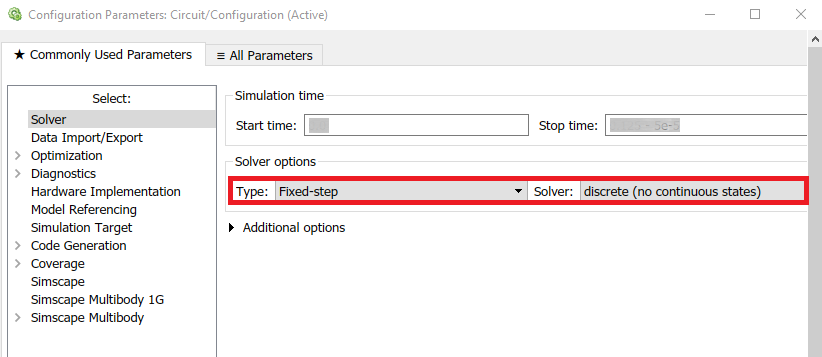
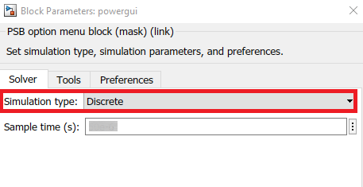
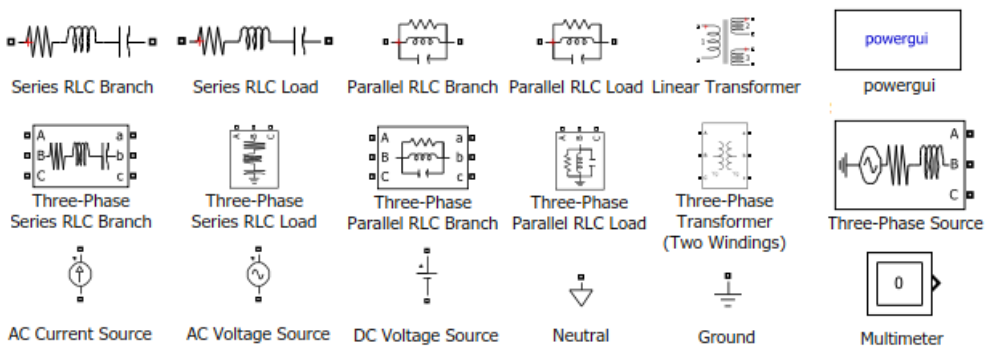

# Auto Design Framework for Real-time Power System Simulators

A prototype implementation of an automatic design framework for real-time power system simulators, in the context of a diploma thesis. A ready-to-use test case is also included.

## General

The purpose of the project is to automate and simplify the design of customized hardware accelerators for power system simulation in the context of smart grids - microgrids, without concerning the user of the platform. The project is divided into two parts: the **user-oriented section**, written and tested in **Matlab R2017a**, and the **hardware-oriented section**, written in VHDL and tested in **ISE Design Suite 14.7 and Vivado 2019.1**. Currently, it supports power networks comprising passive elements (whatever can be modeled as a combination of resistors, inductors and capacitors) and linear transformer models. Support of voltage sources is limited to the user-oriented section for the time being, however current sources are fully compatible. 

## Requirements

1. Matlab R2017a (possible compatibility with other versions supporting the Simscape library of Simulink and its Specialized Technology sublibrary)

2. ISE Design Suite 14.7 or Vivado 2019.1 (possible compatibility with other versions and platforms supporting VHDL-93 standard)

## Instructions for the test case's compilation

1. Clone the repository to your pc

2. Open the `user-oriented section` folder and run the `Circuit.slx` file.

3. Open the `auto_ps_sim_lib.slx` file, copy the `Algorithm 1` and `Algorithm 2` blocks and paste them into the open `Circuit.slx` file.

4. Press the Run button of Simulink, wait for the simulation to finish and double click on the `Algorithm 1` block to start the NIS analysis.

5. Type `y` to receive an error estimation between Simulink and NIS analysis/simulation, or `n` if you are no interested.

6. To convert the `Circuit.slx` model to VHDL-compatible format, double click on the `Algorithm 2` block and specify `word length of 34 bits and fraction length of 19 bits`. Also type `1` when asked if you want to generate text files that will be included to the hardware design.

7. Create a new design in ISE or Vivado design suite. Choose your desired FPGA or board.

7. When asked to add design sources, select all the files from the `hardware-oriented section` folder, except from the `testbench.vhd`, and all the Matlab-generated text files.

8. Synthesize the design.

9. If you want to simulate the design in Vivado, add the Matlab-generated text files and the `testbench.vhd` as simulation sources. In ISE, this isn't needed. Lastly, choose simulation time to be 2502 ns (it is necessary for the simulation and the collection of the results for this specific test case).

10. If you simulated the design in ISE or Vivado, open the directory where the simulation results reside and find `Vnodal_report.txt` and `Ibranch_report.txt`. Copy them to the directory where the `Circuit.slx` is, open it, rerun the Simulink simulation and double click on the `Algorithm 2` block again. This time, when asked, type `2` for error estimation between Simulink and VHDL results.

## Extension of the platform 

This automatic framework is compatible with user designs or libraries. The above instructions also apply for these cases. Special care should be given in 3 Simulink parameters:

1. `Simulink Solver Type: must be "Fixed-step" for right error estimation results`

2. `Simulink Solver: must be "discrete" for right error estimation results`

3. `"powergui" Simulation Type: must be "Discrete" for right error estimation results`

For user library or model design, these are the compatible Simscape Specialized Technology components:

